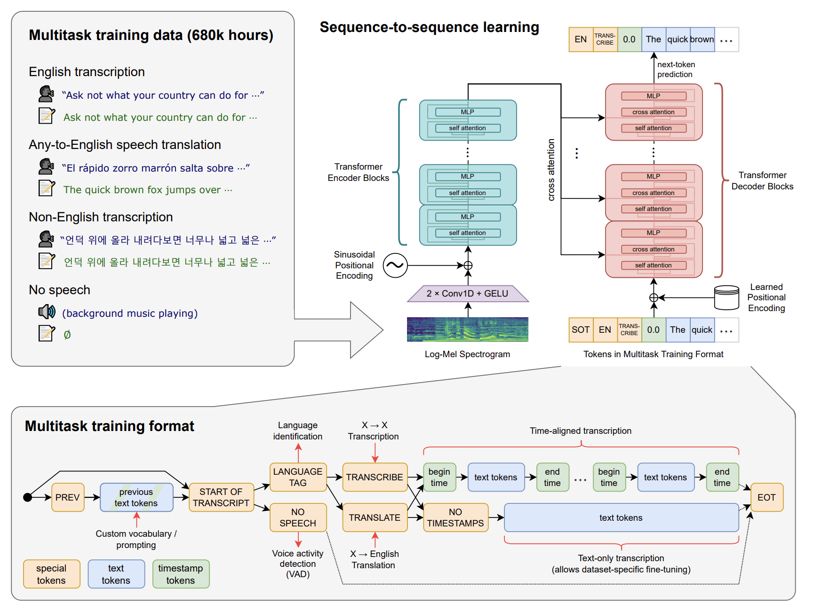

# DISTIL-WHISPER

[https://arxiv.org/pdf/2311.00430.pdf](https://arxiv.org/pdf/2311.00430.pdf)

Авторы предлагают эффективный способ дистилляции Whisper для задачи English ASR + еще несколько подходов для ускорения его работы.

## **Whisper**

Модель для дистилляции - Whisper - жирная Encoder-Decoder модель, состоящая из трансформерных слоев (+ у энкодера еще есть свертки перед ними), которая обучалась на огромном количестве Weakly-Supervised данных сразу на несколько задач:

- English ASR
- Any-to-English speech translation
- Non-English ASR
- VAD

Больше всего в обучении было English ASR данных, причем с огромным отрывом.

## Подход к дистилляции

Для дистилляции авторы выбрали 2 архитектуры: medium и large-v2. Их размер в табличке ниже.

Было предложено взять оригинальную модель, заморозить ей энкодер, а в декодере оставить только 2 слоя (вместо 24/32). Эти слои инициализировали первым и последним слоями из модели-учителя.

Обучают студента с помощью CrossEntropy лосса + KL Divergence.

С чем считаются эти лоссы:

- CrossEntropy считают не с ground truth лейблами, а с псевдолейблами учителя
- KL Divergence считают по распределениям для каждого токена в декодере

Итоговый лосс считается по следующей формуле:

$$
\mathcal{L}_{KD} = \alpha_{KL}\mathcal{L}_{KL} + \alpha_{PL}\mathcal{L}_{PL}
$$

, где первое слагаемое отвечает за KL divergence и берется с коэффициентом 0.8, а второе - за CrossEntropy по псевдолейблам и берется с коэффициентом 1.0.

Также авторы использовали следующую эвристику для отсеивания плохих псевдолейблов:

Для каждого сэмпла считали **WER** между нормализованными ground-truth гипотезой и псевдолейблами и после этого выкидывали из обучения все сэмплы, для которых **WER** был выше установленного зараннее трешхолда (в основных экспах он был равен 10)

## Long-form transcription

В своей работе авторы предлагают заменить предложенный OpenAI алгоритм распознавания длинных аудио.

Оригинальный алгоритм опирается на таймстемпы, которые предсказывает Whisper, чтобы
аккуратно побить аудио на чанки, не разрезая при этом слова посередине. Этот алгоритм строго последовательный, так как начало каждого следующего чанка можно узнать только после обработки предыдущего.

Авторы предлагают использовать подход с разбиением длинного аудио на пересекающиеся чанки, с последующим соединением транскрипций соседних чанков с помощью поиска наибольшей общей последовательности символов ([https://huggingface.co/blog/asr-chunking](https://huggingface.co/blog/asr-chunking))

Картинка из блога, на который они ссылаются (он про СТС, но может стать понятнее)

## Speculative decoding

Также авторы предлагают использовать speculative decoding (код для которого они уже написали в HF). 
В чем суть: есть маленькая модель, которую можно быстро инферить, и большая модель, которая лучше по качеству. Большую модель дорого гонять в авторегрессионном режиме. Давайте тогда будем чанками размера $K$ в авторегрессионном режиме гонять маленькую модель и после каждого чанка один раз прогонять большую. После прогона большой модели для каждого из $K$ токенов мы будем иметь распределение вероятностей большой модели перед ним. Дальше, в самом простом случае, мы сохраняем первые $k$ токенов, которые совпали с гриди-токенами большой модельки. Остальные отбрасываем и начинаем цикл заново. В чуть более сложном стохастическом случае можно играть с распределениями, как в [оригинальной стать](https://proceedings.mlr.press/v202/leviathan23a/leviathan23a.pdf)е. Также это описано на схеме:

## Обучение моделей

Дистиллировали модель на англоязычных опенсорсных датасетах суммарным объемом 21К часов.

Для всех аудио они наделали псевдолейблов с помощью Whisper-large-v2, причем пишут что “нет большой разницы, генерить их с Beam Search или Greedy, поэтому генерировали Greedy”.

Обучали 8 эпох (80000 шагов с батчем 256) без аугментаций / регуляризаций, пишут что  “у нас очень diversity датасет, надеемся что модель и так будет робастной”.

Параметры двух обучаемых моделей в табличке ниже.

## Результаты

Сначала зафиксируем валидационные датасеты. Первая часть - In Domain Data (IDD), сюда входят тестовые сплиты сетов из обучения. Вторая часть - Out of Domain Data (ODD). Датасеты для OOD представлены в табличке ниже.

Суть разбиения на IDD и ODD - проверить способность дистиллированной модели к обобщению на данных, на которых она не обучалась (OOD).

Также валидационные сеты делятся на *Long Form* и *Short Form:*

- Данные с длинными сэмплами, для распознавания которых надо применять описанный выше алгоритм с чанками)
- Данные с короткими сэмплами

### Short-Form Evaluation

В таблице ниже для оригинальных и дистилированных моделей приведены метрики WER и Relative latency - относительное время инференса в сравнении с large-v2 моделью: быстрее модель - выше Rel. latency. Метрики здесь считались и усреднялись по OOD данным - чтоб проверить способность к обобщению.

Видим, что дистилированные модели сильно быстрее своих учителей. Более того, т.к. при инференсе  бОльшую часть вычислений съедает декодер (энкодер прогоняем один раз чтоб посчитать аудио-фичи, декодер гоняем в авторегрессионном режиме пока не получим <EndOfSequence>), дистилированные модели, в которых декодер состоит из двух слоев, получаются значительно быстрее маленьких оригинальных моделей. Ускорение **distil-large-v2** относительно **large-v2** почти такое же, как и у **tiny-**модели: 5.8 vs 6.1 Rel. Latency. Качество на OOD-данных просело, но не критично: WER **9.1** vs **10.1** для **large-v2** модели и **distil-large-v2** соответственно.

Результаты на In Domain Data они привели в аппендиксе (табличка ниже), и на этих данных дистилированная модель получается даже лучше учителя: WER **12.8 (distill-large-v2)** vs **13.9 (large-v2)**. Я связываю это с тем, что маленькой модели не нужно было обощаться на огромное количество задач и на multitask-learning, что позволило ей лучше подстроиться под свой трейн.

### Long-Form Evaluation

Результаты моделей на длинных записях представлены на той же табличке (вставил ее внизу). Как вижно здесь, дистилированная модель получается даже лучше оригинальной (для large-версии). Важно здесь отметить, что замеры проводились с предложенным авторами [**CHUNK-**алгоритмом](DISTIL-WHISPER.md), а не с оригинальным алогортимом, предложенным OpenAI.

Также авторы приводят сравнение алгоритмов распознавания длинных записей (табличка ниже).

Видно, что алгортим OpenAI работает лучше, но значительно дольше. Та же самая модель **large-v2** работает в 10 раз быстрее с алгоритмом из этой статьи за счет возможности распознавать сегменты независимо друг от друга, но получают ухудшение по WER-у. При использовании дистилированной модели скорость распознавания увеличивается еще в 6 раз, по итогу получая 60-кратное ускорение в сравнении с бейзлайном. Кажется, что такое ускорение вполне себе стоит просадки по WER-у + намного проще будет катить такой алгоритм.

### Robustness to Additive Noise

Приводят графики с WER-ом на LibriSpeech test-clean по оси ординат и signal-to-noise ratio по оси абсцисс. С помощью них они показывают, что дистилированная модель сохраняет важное свойство оригинальных OpenAI-моделей устойчивости к шуму. Также на графики добавили несколько моделей, обученных на домене LibriSpeech, которые показывают лучший результат при низком уровне шума, но с добавлением шума начинают проигрывать Whisper-у и его дистилированным версиям.

На графике слева используется белый шум, на графике справа - “шум толпы”.

### Robustness to Hallucinations

Следующим пунктом авторы показывают, что их модель меньше склонна к галлюцинациям (предсказание слов в тишине, повторение одних и тех же слов, ..) чем оригинальная модель. Для этого они приводят таблицу, в которой замеряют составляющие WER-a и количество повторяющихся 5-грам дубликатов слов.

Видно, что для дистилированных моделей снизился Insertion Error Rate, т.е. модель меньше склонна вставлять неправильные слова. Substitution Error Rate наоборот вырос, т.е. дистилированная модель чаще делает ошибки в словах. Количество дубликатов также уменьшилось.

### Speculative Decoding

В этом пункте авторы показывают ускорение работы модели с помощью [Speculative Decoding](DISTIL-WHISPER.md). Они сравнивают ускорение medium и large-v2 моделей с помощью их дистилированных версий и с помощью tiny моделей. Метрики качества не указаны т.к. Speculative Decoding не меняет результат.

Видим, что дистилированные версии моделей ускоряют Speculative Decoding не хуже, чем tiny-версия (а для medium модели даже лучше). 

Это можно объяснить так:

1. Дистилированная модель умнее tiny-модели и меньше ошибается, соответственно меньше раз приходится прогонять большую модель
2. У дистилированных моделей энкодер совпадает с большой моделью, что также дает небольшой выигрыш в скорости и памяти при декодировании

Подытожим: дистилированные модели крутые. Работают очень быстро, по WER-у просели несильно, робастны по отношению к шуму. Лично мне не хватило результатов по End-To-End способностям, т.е. качество пунктуации и остальной денормализации. Но даже в оригинальной статье по Whisper-у не было таких замеров, так что это просто мои хотелки…

## Ablations

Некоторые интересные ablations.

TO BE DONE