# SpeechLM: Enhanced Speech Pre-Training with Unpaired Textual Data

https://arxiv.org/pdf/2209.15329

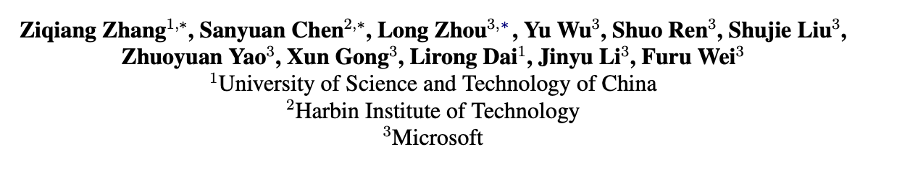

Авторская группа в составе вышеперечисленных коллег из Китая представляет свое видение касательно использования текстовых данных для улучшения SSL-претрейна аудио-энкодера. Подход подразумевает выучивание своего рода общего векторного пространства для аудио и текста. Метрики получились интересные (SOTA, если брать сравнимые эксперименты из других статей по претрейну), также доступен [репозиторий](https://github.com/microsoft/SpeechT5/tree/main/SpeechLM) с кодом.

## Motivation & Related Work

В последнее время были разработаны нейросети, позволяющие делать Self-Supervised Representation Learning как для текстов (BERT, GPT, ELECTRA, …), так и для аудио (Wav2Vec*, HuBERT, PBERT, …). Из нейробиологии известно, что наш мозг делает препроцессинг спича и текста в разных отделах коры головного мозга, а затем извлекает смысл в одной и той же области, называемой [областью Вернике-Гешвинда (Wernicke-Geschwind)](https://en.wikipedia.org/wiki/Wernicke–Geschwind_model). 

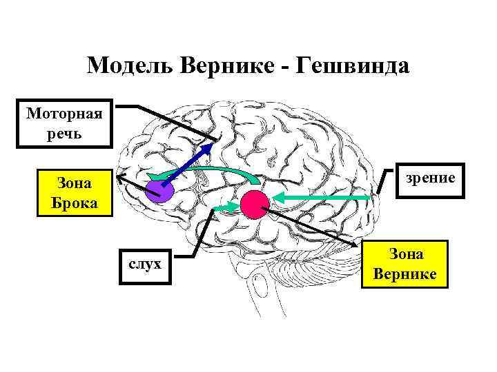

В первых двух ссылках из Яндекса, в том числе в Википедии, можно прочитать что эта модель устарела, в основном из-за проблем с зоной Брока, отвечающей за говорение. Но отсылка прикольная. 

Если на картинке заменить мозг LLM-кой, получим Multimodal LLM🧑‍🔬

Вернемся к настоящей науке. Мотивированные вышеописанной отсылкой, авторы решают сделать нейронку с отдельными препроцессорами для аудио/текста и с объединенным пространством представлений.

Казалось бы, идея инновационная, но немного раньше она уже приходила в голову авторам моделей SLAM и Maestro.

Для понимания рассмотрим принцип работы этих моделей.

### [SLAM](https://arxiv.org/pdf/2110.10329)

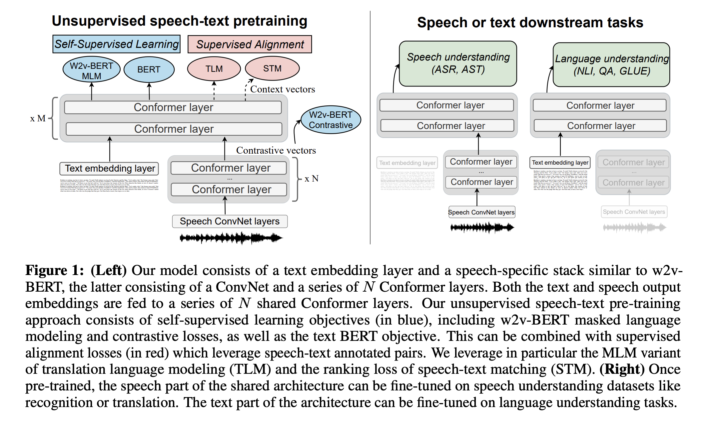

Первая Модель от Гугла, в которой делается претрейн на аудио + тексте.

Архитектура дефолтная:

- Текстовый энкодер - EmbeddingLayer + Absolute Positional Encoding
- Аудио-энкодер:
    - SumSampling - 2x 2D-свертки со страйдом 2
    - 8 Conformer Layers: dim=1024, conv_kernel_size=5, attn_heads=8
- Пошаренный конформер, который принимает выходы из предыдущих двух энкодеров - 16 слоев конформера, слои аналогичны аудио-энкодерным

Задачи обучения:

- 2 SSL-задачи для обучения на text/audio-only неразмеченных данных:
    - BERT для текста. Дополнение - маскируют токены спанами ([SpanBERT](https://arxiv.org/abs/1907.10529))
    - [w2v-BERT](https://arxiv.org/abs/2108.06209) для аудио. Состоит из wav2vec2-contrastive задачи (решается после 8-го слоя модели) + MLM задачи на дискретных токенах, которые получаем из обучаемого кодбука wav2vec2-задачи
- Alignment-задачи, использующие supervised ASR-данные:
    - Translation Language Modeling
        
        Изначально эта задача была использована в NLP для обучения пошаренного энкодера для текстов на разных языках.
        
        Принцип очень простой - конкатенируем текстовые последовательности на разных языках (насколько я понял, в оригинале используются предложение + его перевод на другой язык), добавляем (или нет) к ним эмбеддинги языков и учим в BERT стиле - модель научится cross-modal контексту.
        
        
        
        В нашем случае, мы используем эмбеддинги аудио + эмбеддинги соответствующей этому аудиио транскрипции, задача обучения - все та же, MLM. В качестве таргетов для маскированных эмбеддингов в аудио берем те же токены, что брали для w2v-BERT.
        
    - Speech-Text Matching
        
        Предсказание того, являются ли поданные на вход аудио + текст парой, т.е. является ли текст транскрипцией этого аудио. Для этого в текст добавляют CLS-токен и прикручивают к нему классификационную голову
        
    
    Предлагают 2 сетапа обучения:
    
    - Учить сразу на все задачи:
        - Подаем unsupervised speech и считаем лосс
        - Подаем unsupervised text и считаем лосс
        - Подаем пару аудио+текст, считаем лосс по задачам Alignment-а
        - Усредняем градиентты и делаем шаг обновления
    - Сначала делать unsupervised претрейн на 500К шагов, затем учить еще 250К-500К шагов на все задачи
    
    Заметили, что второй подход дает буст 0.1-0.2 WER на Либриспиче и 0.3 BLEU на CoVoST 2.
    
    В качестве данных для претрейна брали только английские сеты:
    
    - Unsupervised Speech - Libri-light 60K
    - Unsupervised Text - LibriLM + mC4-En
    - Paired Data - LibriSpeech
    
    Получившиеся результаты:
    
    1. Задача Speech Translation. Дообучали модель на CoVost 2 с помощью LAS-модели с 4-слойным трансформерным декодером
        
        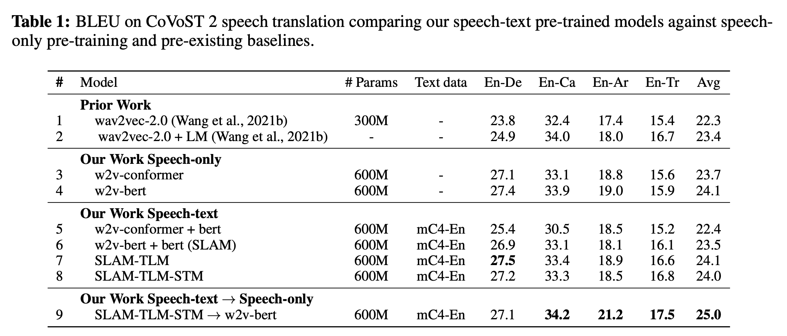
        
        В качестве бейзлайна сами сделали претрейн w2v-bert и w2v2. Этот бейзлайн затем просадили добавлением в претрейн текста, но с помощью alignment-лоссов смогли его вернуть. Затем попробовали взять модель после предобучения + alignment-а и еще дообучить в w2v-bert сетапе. Метрики выросли еще сильнее.
        
    2. Задача ASR
        
        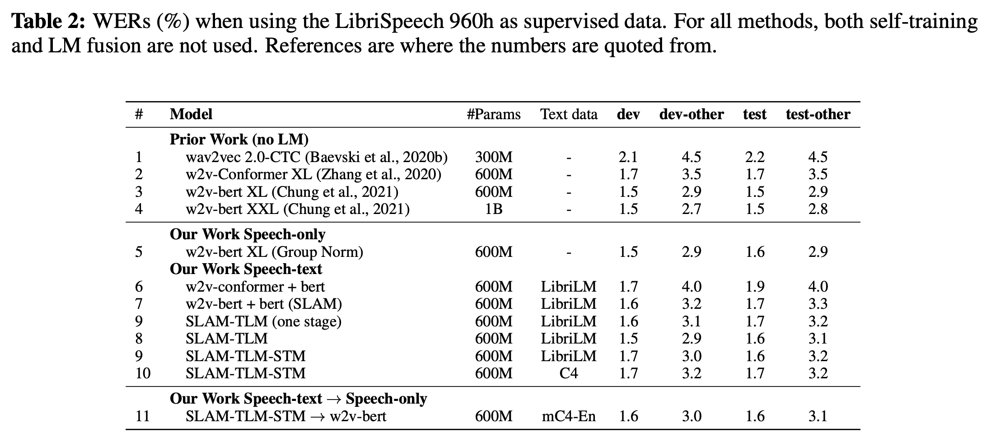
        
        Учили с RNN-T декодером.
        
        Опять просадили качество относительно своего же speech-only бэйзлайна.
        
    3. GLUE-задачи
        
        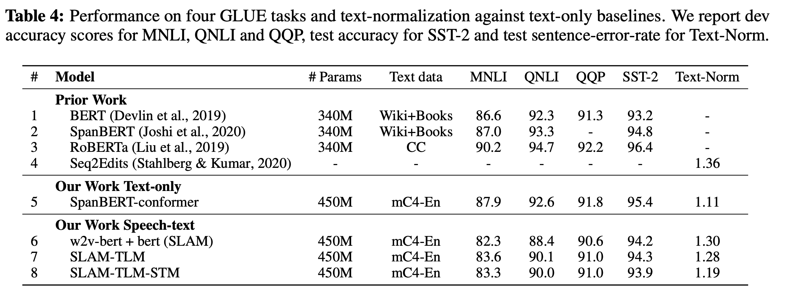
        
        И снова добавление второй модальности просаживает метрики, теперь уже текстовые.
        
    
    **Итог:**
    Интересно, прикольно, улучшений для ASR (и не только) от использования текстовой модальности нет.
    

### [Maestro](https://arxiv.org/pdf/2204.03409)

Следующая попытка коллег из Google сделать text+audio претрейн. Более удачная, если судить по метрикам.

Авторы предлагают фреймворк, который может учиться на:

- unsupervised text data
- unsupervised audio data
- Any available labeled data (paired speech & text)

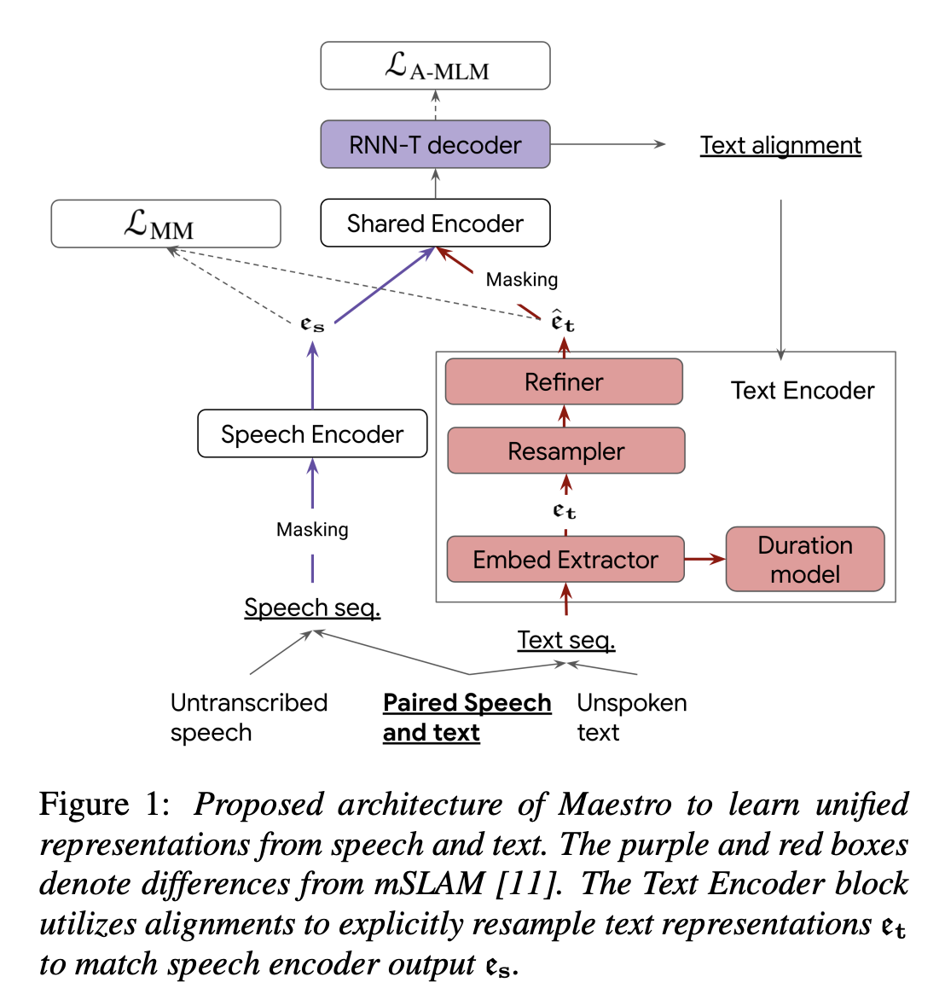

Архитектура в общих чертах напоминает SLAM - есть Speech Encoder, есть Text Encoder, есть Shared Encoder. 

Но еще откуда-то взялся RNN-T декодер. Да и в Text Encoder-е стоят непонятные модули. Разберемся по пути.

**Процесс обучения**

1. **Learning Initial Embeddings**
    
    Обучают Speech Encoder $\theta_s$ на задачу w2v-BERT, лосс которой сфокусирован на локальной акустической и фонетической информации. 
    
    С другой стороны, text embedding extractor $\theta_t$ обучен доставать лексическую информацию из поданного текста. (как получают - хз, видимо будет описано дальше. UPD: Не описано. Мб выдергивают слои из BERT-а)
    
2. **Learning Aligned Embeddings**
    
    Выученные изначально эмбеддинги аудио $e_a$ и текстов $e_t$ не лежат в одном пространстве. Как пишут авторы, попытка объединения пространств эмбеддингов без внимания к alignment-у может привести к плохим результатам. Поэтому они предлагают следующий итеративный процесс self-alignment-а:
    
    **2.1)** **Paired Speech and Text Input**
    
    Берут RNN-T декодер, берут доступные размеченные данные и выучивают RNN-T модель. Во время обучения на размеченных парах аудио-текст, *Text Encoder* использует RNN-T модель чтобы генерить alignment-ы между предсказанным текстом $t$ и выходом speech encoder-а $e_s$.
    
    Далее, слои *Resampler* и *Refiner* реплицируют изначально выученные текстовые эмбеддинги для соответствия длительности эмбеддингов аудио, используя эту *alignment-*информацию и MSE следующим образом:
    
    $$
    e_s = \theta_s(s), \text{ } e_t = \theta(t), \text{ } (t, s) \in \mathcal{X}_{paired}
    $$
    
    $$
    \hat{e}_t = \theta_{Refiner}(Resample(e_t, \operatorname{Align}_{Rnnt}(e_s, t)))
    $$
    
    $$
    \mathcal{L}_{MM} = \operatorname{MSE}(e_s, \hat{e}_t) + \mathcal{L}_{RNNT}(t | e_s)
    $$
    
    Как работает модуль *Align:*
    
    - Токенайзер у RNN-T декодера такой же, как и у Text Encoder-а
    - Мы смотрим, какие токены с каких аудио-эмбеддингов были предсказаны и реплицируем соответсвтующий эмбеддинг этого токена из Text Encoder-а нужное количество раз
        
        Например, пусть у нас длина последовательности аудио-эмбеддингов равна $\operatorname{len}(\{e_a^i\}) = N$,  а длина последовательности текстовых эмбеддингов из Text Encoder-а равна $\operatorname{len}(\{e_t^i\}) = M$.
        
        - Мы хотим умным образом составить последовательность текстовых эмбеддингов, равную по длине последовательности аудио-эмбеддингов, чтоб затем считать по ним лосс с помощью MSE.
        - Берем RNN-T декодер и начинаем делать ASR.
        - Пусть первый текстовый токен эмиттится после $k-$го аудио-токена
        - Мы берем текстовый эмбеддинг этого токена из Text Encoder $e_t^1$, и дублируем его $k$ раз, добавляя в каждый из них свой позиционный эмбеддинг (позиция 1, позиция 2, …, позиция $k$)
        - Затем повторяем так для каждого последующего текстового токена
        - На выходе имеем последовательность реплицированных текстовых эмбеддингов, равную по длине последовательности аудио-эмбеддингов
        - Прогоняем эту последовательность через слой *Refiner* (2 конформерных слоя с 8-головым аттеншном и lightweight convolution с ядром 17)
    
    **2.2) Unpaired text input**
    
    Когда на вход приходят text-only данные, информация об алайнменте из RNN-T декодера недоступна. Решают эту проблему с помощью модуля *duration prediction model,* который предварительно предобучают, тем самым получая возможность делать упомянутый в прошлом пункте Resampling без алайнмента из RNN-T декодера.
    
3. **Aligned Masked Language Model Training Objective**
    
    Имея возможность получать speech-aligned текстовые эмбеддинги, можно использовать RNN-T лосс как для парных аудио-текстовых данных, так и для text-only данных.
    
    Авторы заменяют оригинальный MLM/BERT лосс на *aligned masked language model* training objective $\mathcal{L}_{A-MLM}$, который представляет из себя RNN-T лосс, примененный поверх замаскированной последовательности полученных в прошлом пункте реплицированных текстовых эмбеддингов $\hat{e}_t$, где маскирование делается аналогично [SpecAugment](https://arxiv.org/abs/1904.08779) - как по оси времени, так и по оси фичей.
    
    Для наглядности, формула для подсчета AM-MLM лосса в случае text-only данных:
    
    $$
    e_t = \theta_t(t), \text{ }\hat{e}_t = \theta_{Refiner}(Resample(e_t, \theta_{Duration}(e_t)))
    $$
    
    $$
    \mathcal{L}_{A-MLM} = \mathcal{L}_{RNNT}(t | \operatorname{Mask}(\hat{e}_t)), \text{ } t\in \mathcal{X}_{text}
    $$
    

**Сетап обучения**

Авторы предлагают как monolingual (English) сетап, так и multilingual. Рассмотрим только monolingual т.к. сравниваться с другими статьями планируем в нем.

- Unsupervised Speech - Libri-light 60K
- Unsupervised Text - LibriLM + TEDLIUM
- Paired Data - SpeechStew (LibriSpeech + CV + …) - объединение открытых датасетов

Сравнение с SLAM уже будет не совсем честным - MAESTRO использует сильно больше paired-данных. Ну окей.

Speech Encoder и Shared Encoder - такие же как в SLAM, 6 + 18 слоев конформера.

Text Encoder:

- Токенизатор + 3 слоя сверток с ядром 5 + 6 слоев трансформера
- Refiner - 2 слоя конформера со сверткой с ядром 17
- Duration model - 4 блока lightweight convolution с ядром 3

RNN-T декодер - 2 LSTM-слоя размерности 1280 + joint network размерности 640.

В monolingual-сетапе использовали 2 декодера: phoneme и grapheme (?)

Обучение начинают с 500К шагов speech-only, затем на 15К шагов добавляют transcribed speech и затем еще 300К шагов обучают, подавая в модель speech, unspoken text и transcribed speech в каждом батче с фиксированными долями.

**Результаты**

В табличке результаты для задачи ASR. Как уже

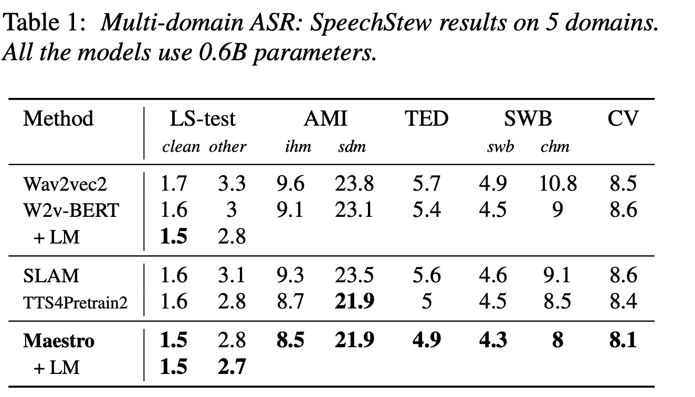

На этот раз получились результаты лучше, чем в speech-only сетапе.

Огонь.

Возвращаемся к SpeechLM. Смотря на две предыдущие работы, авторы говорят что “Взаимодействие между аудио-  и текстовым энкодером не очень хорошо изучено, что, вероятно, приводит к тому, что энкодеры дают на выходе фичи в разных векторных пространствах. Из-за этого общий энкодер страдает от интерференции этих пространств и его capacity страдает из-за этого”. 

Не совсем понял этого вывода, возможно этим самым они имеют ввиду “SLAM и MAESTRO пытаются делать какие-то alignment-лоссы, причем учиться на эти лоссы можно только на supervised данных. А мы делаем общую таску для двух модальностей, что лучше матчит векторные пространства”.

## Architecture & Methods

SpeechLM делает unified аудио + текст претрейн с помощью использования дискретных токенизаторов, которые переводят обе модальности в общее дискретное пространство.

Авторы рассматривают два вида токенизаторов (каждый работает как с аудио, так и с текстом):

- Phoneme-Unit токенизатор - конвертирует speech & text в пространство фонем
- Hidden-Unit токенизатор - конвертирует speech & text в пространство акустических кластеров

Реализацию и работу каждого из токенайзеров рассмотрим чуть позже.

В формулах описание работы токенизатора будет следующим:

- Получаем на вход спич $S$ или текст $Y$
- Берем токенизатор $\mathcal{T}_S$ для спича или $\mathcal{T}_T$ для текста
- Получаем последовательность дискретных представлений
    
    $$
    Z_s = (z_{S_1}, \dots, z_{S_M}) = \mathcal{T}_S(S),
    
    $$
    
    $$
    Z_T = (z_{T_1}, \dots, z_{T_N}) = \mathcal{T}_T(Y)
    $$
    

Теперь к самой модели.

### Model architecture

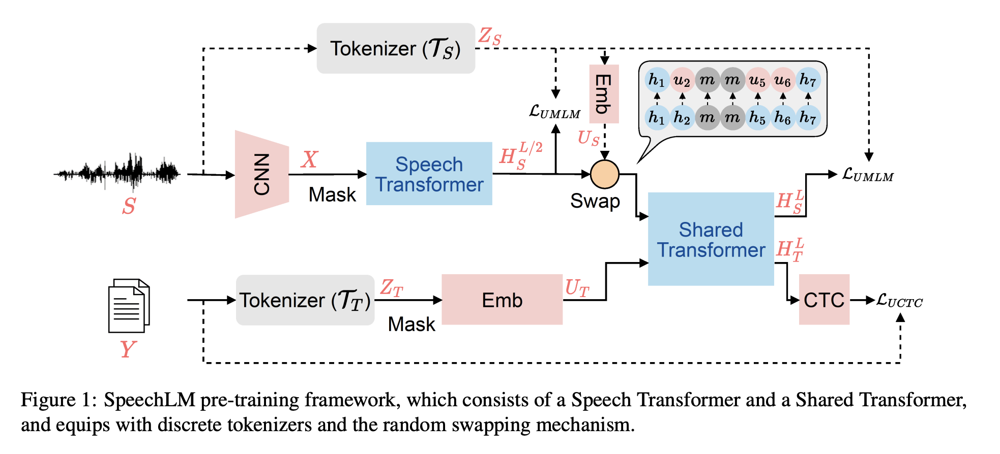

Состоит из двух основных модулей - **Speech Transformer** и **Shared Transformer.**

Что происходит в Speech Transformer-е:

- На вход прилетает вавка $S$, ее обрабатываем стаком сверточных слоев и получаем последовательность фичей $X = (x_1, \dots, x_M)$.
- Происходит маскирование фичей $\operatorname{Mask}(X) = \hat{X}$
- Маскированные фичи передаются в слои трансформера, где получаются контекстно-обусловленные представления $H_S^l = \operatorname{Transformer}(H_S^{l-1})$

Обозначим за $L$ - общее число транфсормерных слоев (в Speech Transformer + Shared Transformer). Авторы решили, что число слоев в Speech Transformer будет половиной от общего числа слоев, соответственно аутпут из него будет задаваться формулой 

$H_S^{L/2} = (h_{S_1}^{L/2}, \dots, h_{S_M}^{L/2})$.

Что происходит в Shared Transformer-е:

- На вход прилетает либо выход Speech Transformer-а $H_S^{L/2}$, либо вектора из *Unit Embedding Space* $U_T = (u_{T_1}, \dots, u_{T_N})$, которые получаются на выходе слоя текстовых эмбеддингов после применения этого слоя к вышеописанным токенам $Z_T$:
    
     $U_T = \operatorname{Emb}(Z_T)$.
    
- Для текстовых представлений $H_T^L$ дополнительно применяется CTC-голова, которая конвертирует их в побуквенные представления. Для чего это нужно - опишем позже.

Также авторы вводят и описывают **Random Swapping Mechanism** для лучшего алайнмента общего пространства для аудио и текстов на первых слоях Shared Transformer-а.

Для этого выбираем несколько индексов на оси времени (только немаскированных) из выхода Speech Transformer-а и подменяем их unit-embedding-ами токенов, которые получаются при токенизации спича и применением того же эмбеддинг-слоя, который применяется к текстовым токенам: 

$$
u_{S_i} = \operatorname{Emb}(z_{S_i})
$$

Так у нас происходит смешение двух пространств (спич-представление из Speech Encoder и векторы из Unit-Embedding пространства) перед их обработкой общим трансформерным энкодером.

### Pretraining Tasks

Обучается модель на два лосса.

1. **Unit-Based Masked Language Modeling (UMLM)**
    
    HuBERT-like лосс. Берем $l$-ый слой трансформера $H_S^l = (h_{S_1}^l, \dots, h_{S_M}^l)$ и предсказываем из него токены $Z_S$ на маскированных позициях.
    
    Этот лосс применяют как на выходе Speech Tranformer-а, так и на выходе Shared Transformer-а. После этого их складывают.
    
2. **Unit-based Connectionist Temporal Classification (UCTC)**
    
    Берут текстовые токены $Z_T$ и пытаются распознать оригинальный текст с помощью Shared Transformer-а и CTC-головы. 
    
    Для усложнения задачи входная последовательность $Z_T$ маскируется.
    

Посредством объединенного обучения на текстовую и аудио задачу + использованием Random Swapping механизма модель хорошо выучивает общее внутреннее представление.

### Unified Tokenizers

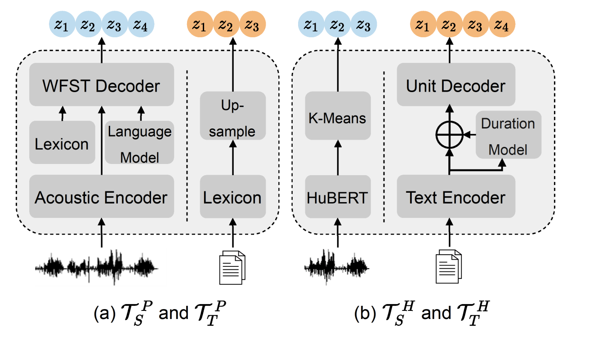

Схематично работа токенизаторов представлена на картинке выше.

- **Phoneme-Unit Tokenizer** $\mathcal{T}^p$
    
    Название говорит за себя - разбивают входные спич / текст на фонемы.
    
    Текст разбивается по грамматическим правилам, затем полученные фонемы повторяются случайное число раз для матчинга с распределением длин спича, конкретно делали распределение похожим на распределение для train-сета LibriSpeech-а.
    
    Для получения фонем из аудио-инпутов обучали GMM-HMM ASR модель на Либриспиче с помощью Kaldi. Не совсем шарю за такого рода модели, но, судя по всему, они позволяют получать пофреймовые предсказания для фонем.
    
- **Hidden-Unit Tokenizer** $\mathcal{T^H}$
    
    Для получения спич-токенов брали предобученный HuBERT и делали K-Means кластеризацию над его промежуточными стейтами.
    
    Текстовые токены получать сложнее, для этого обучают отдельную модель, основанную на FastSpeech и состоящую из текстового энкодера, duration-predictor-а и unit decoder-а (см. картинку выше).
    
    - **Отдельная модель**
        
        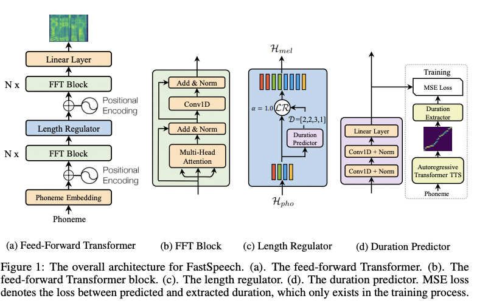
        
        TODO
        

## Experiments & Results

Делают эксперименты с ASR, ST и замеряют качество модели на SUPERB.

В зависимости от используемого токенизатора, пассматривают две версии модели: **SpeechLM-H** (hidden unit tokenizer) ****и **SpeechLM-P** (phoneme tokenizer).

Также рассматривают 2 сетапа обучения, отличающихся размером:

- Base - уичтся на:
    - unlabeled speech - LibriSpeech 960 hours
    - tokenizers training - LibriSpeech 100 hours
    - unlabeled text - LibriSpeech LM

- Large - уичтся на:
    - unlabeled speech - LibriLight 60K hours
    - tokenizers training - LibriSpeech 960 hours
    - unlabeled text - LibriSpeech LM

Файнтюн делают на Либриспиче-960 для задачи ASR и на CoVoST-2 для ST.

Для ASR-файнтюна используют CTC-лосс, для ST-файнтюна используют Encoder-Decoder.

**Результаты ASR**

Видим явные улучшения в сравнении с бейзланами в виде wav2vec2, HuBERT, PBERT, …

Также видим, что токенизатор на фонемах работает лучше.

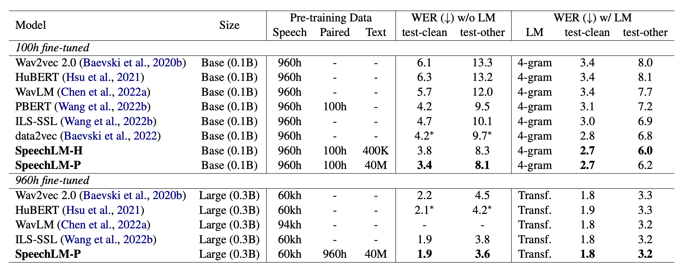

**Результаты ST**

Видим улучшение в сравнении с уже знакомым нам SLAM.

Снова видим, что токенизатор на фонемах работает лучше.

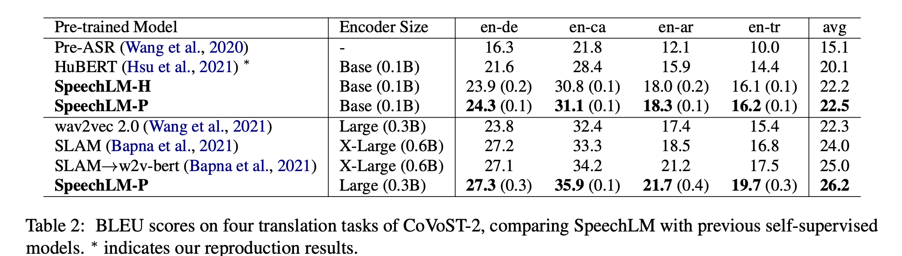

**Результаты SUPERB**

Видим, что модель значимо лучше работает на PR, ASR и ST. В то же время нет капитальных просадок на остальных тасках.

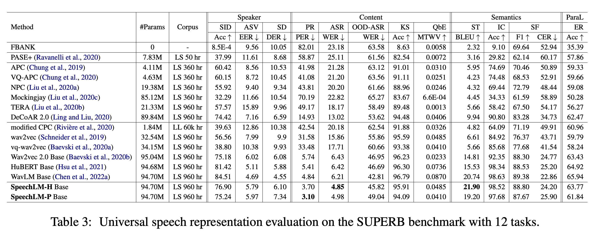

**Ablations**

Авторы проводят ablation, в котором ислледуют эффективность использования:

- Random Swapping Mechanism
    
    Вердикт: полезен
    
- Токенизаторов для speech-only предобучения
    
    Вердикт: результаты схожи
    
- Использования обучаемых токенизаторов: проводят эксперимент с hidden-unit токенизатором для аудио и phoneme-токенизатором для текста
    
    Вердикт: сильно хуже, чем использовать один и тот же токенизатор для аудио и текста
    

Результаты:

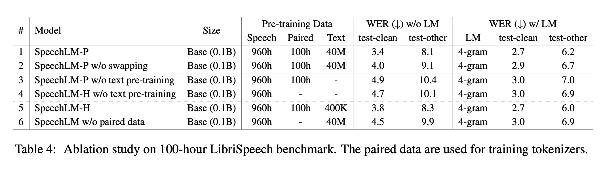

Также строят график зависимости WER-а от количество текстовых данных, используемых на претрейне:

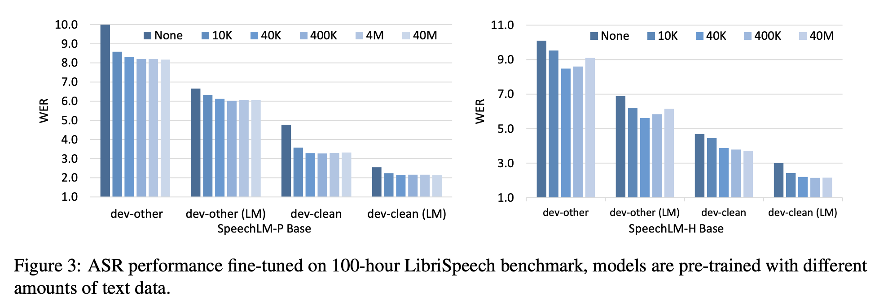

Интересно, что для модели с фонемным токенизатором в какой-то момент наступает насыщение, а модели с hidden-unit токенизатором в какой-то момент большое количество текстовых данных начинает даже вредить.

## Conclusion

Прикольно, интересно, результат хороший. Но надо учить GMM-HMM модель и делать фонемизатор для русских слов.