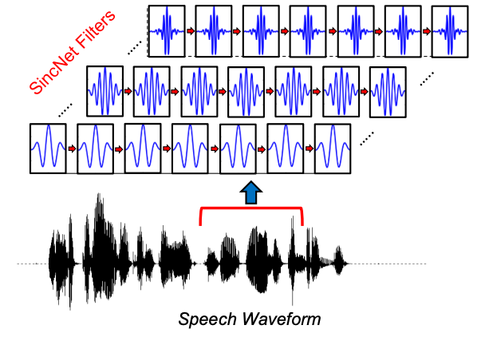

# pyannote

[**pyannote.audio 2.1 speaker diarization pipeline: principle, benchmark, and recipe**](https://www.isca-speech.org/archive/pdfs/interspeech_2023/bredin23_interspeech.pdf)

https://github.com/pyannote/pyannote-audio

three main stages:

- speaker segmentation (short sliding window)
- neural speaker embedding (local)
- agglomerative clustering (global)

- end-to-end speaker segmentation model
    
    [End-to-end speaker segmentation for overlap-aware resegmentation](https://arxiv.org/pdf/2104.04045.pdf) (InterSpeech, 2021)
    
    - Model:
        - SincNet trainable features
            
            [Speaker recognition from raw waveform with sincnet](https://arxiv.org/pdf/1808.00158.pdf)
            
            
            
        - 4 x LSTM
        - 2 x feed-forward
        - $K_{max}$ output speakers
        - 16ms time resolution
    - Training:
        - multi-label classification
            
            
            
        - permutation-invariant loss:
            
            $$
            \mathcal{L}(y, \hat{y}) = \min_{\text{perm}(y)} \mathcal{L}(\text{perm}(y),\hat{y})
            $$
            
    - Inference:
        - Speaker Segmentation:
            
            $$
            y_t^k > \theta
            $$
            
            - more advanced:
                
                [Optimization of RNN-Based Speech Activity Detection](https://www-tlp.limsi.fr/public/talsp2018-gelly08100927.pdf)
                
                
                
        - Voice Activity Detection:
            
            $$
            \hat{y}_t^{\text{VAD}} = \max_k \hat{y}_t^k
            $$
            
        - Overlapped Speech Detection:
            
            $$
            \hat{y}_t^{\text{OSD}} = {\max_k}_{\text{2nd}} \hat{y}_t^k
            $$
            
- neural speaker embedding

1. local neural speaker segmentation (5s window, 500ms step)
    
    sliding window ⇒ test-time augmentation
    
    
    
2. binarization: $\hat{y}_t^k > \theta$
    
    
    
3. local speaker embedding
    
    
    
4. global clustering: agglomerative, $\delta$ threshold
    
    
    
5. final aggregation
    1. $K_f$ : estimate number of speakers: sum binarized segmentation result (averaged over windows)
        
        
        
    2. estimate score of each cluster: sum clustered speaker segmentation score over windows
        
        
        
    3. select $K_f$  clusters with highest score
        
        
        
    4. filling within-speaker gaps shorter than $\Delta$
        
        
        

### Results

Hyperparameters:

- $\theta$ (used for binarizing speaker segmentation) is the most important hyper-parameter to tune
- followed by $\Delta$ (for filling short intra-speaker gaps)
- and then only $\delta$ (that serves as stopping criterion for the clustering stage)

## Evaluation: Diarization Error Rate (DER)

.png)

.png)

.png)

%201.png)

%201.png)

%201.png)

%202.png)

%202.png)