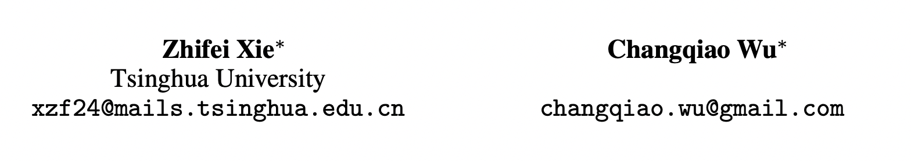
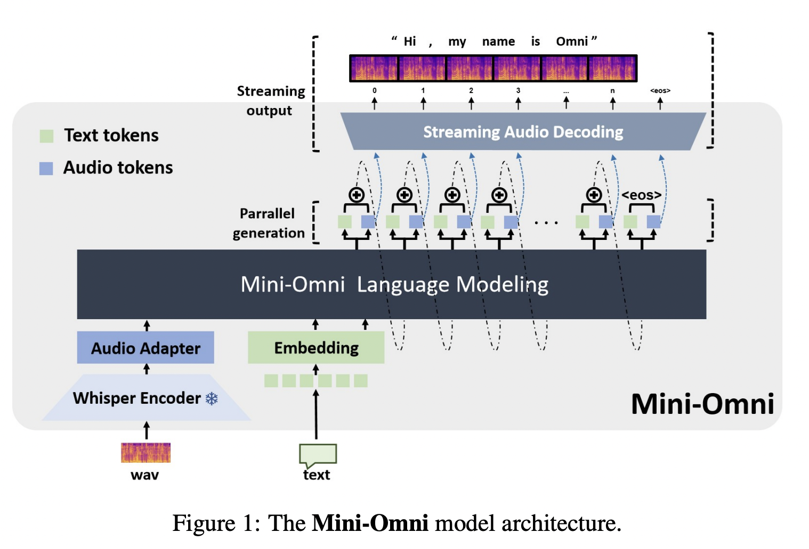
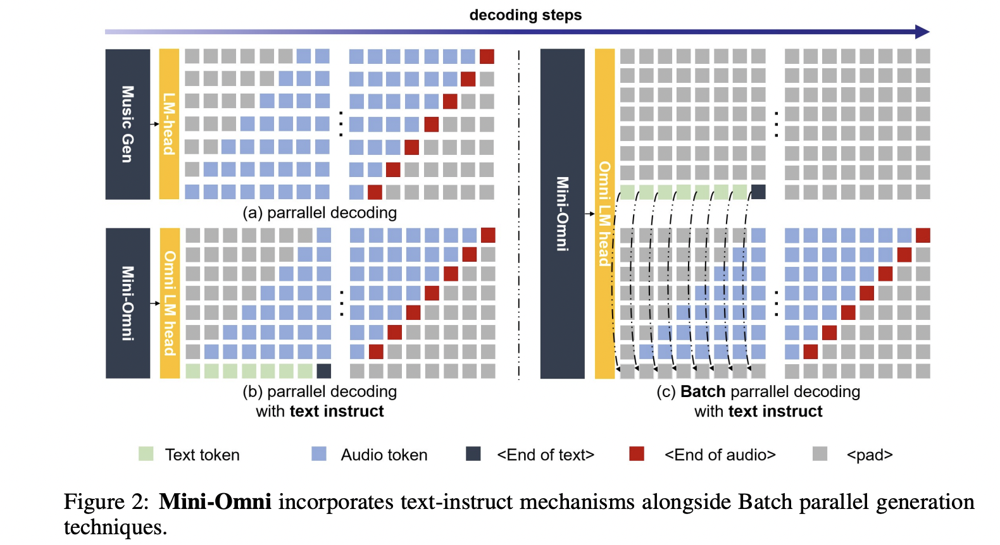
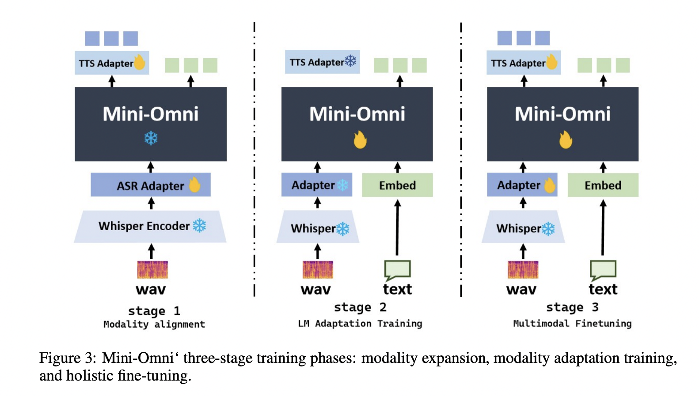
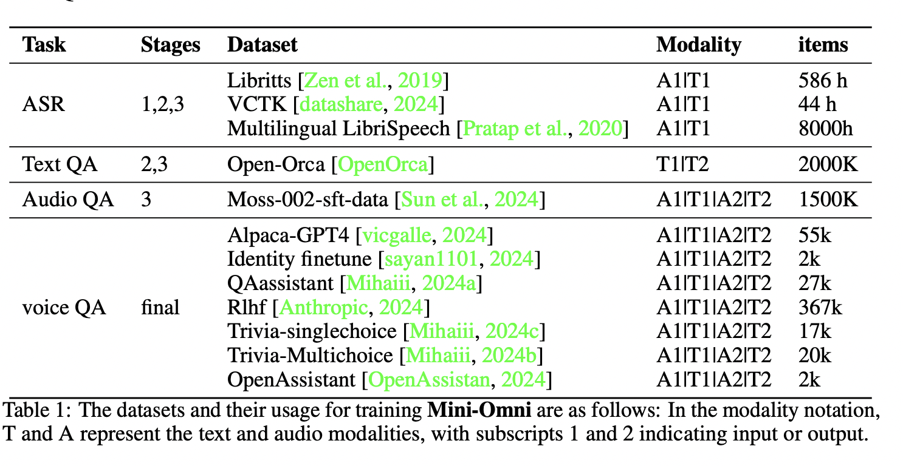
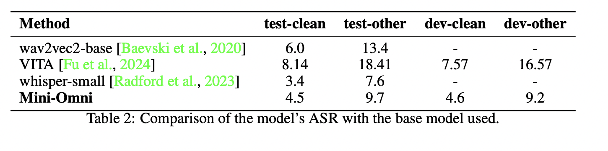
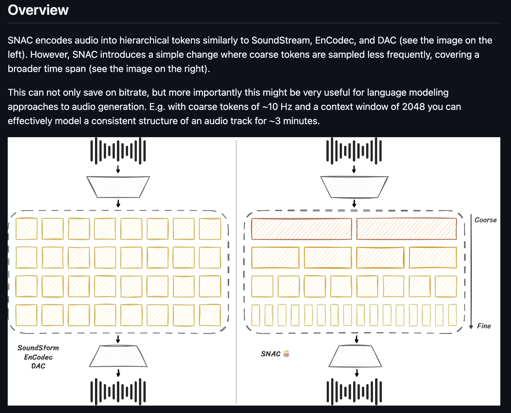

# Mini-Omni: Language Models Can Hear, Talk While Thinking in Streaming

[https://arxiv.org/pdf/2408.16725](https://arxiv.org/pdf/2408.16725) 

[https://github.com/gpt-omni/mini-omni](https://github.com/gpt-omni/mini-omni)

Два товарища из Китая представляют интересный подход к созданию SpeechLLM.

Интересная часть заключается в инженерной части синтеза речи.

## Model architecture

На первый взгляд в этой архитектуре не так много интересного:

- Замороженный Whisper-Encoder с обучаемым адаптером для восприятия звука
- LM-ка
- Декодинг текстовых + аудио токенов, где аудио-токены берутся из кодека SNAC и каждый из них, затем, озвучивается SNAC-декодером

Если верить авторам, их архитектура SpeechLLM - первая, которая декодит аудио-токены вместе с текстовыми. Окей, круто, но как-то не тянет на “интересный подход”.

Чтобы стало интересно, нужно внимательно посмотреть на схему декодирования и предложенный авторами лайфхак, об этом ниже.

Идея авторов следующая: текстовая LLM-ка хорошо обуславливается на текст, когда генерит текст. Но если учить ее генерить аудио-токены по тексту, она потеряет большУю часть этой способности. Какой выход - генерить и текст, и аудио-токены, которые будут опираться на сгенерированный текст. Так модель будет меньше сходить с ума на файнтюне и будет выдавать аудио-ответы, по качеству не сильно уступающие текстовым.

С другой стороны, она будет способна делать streaming-audio-generation, в отличие от подхода, когда мы сначала генерим текст, а затем делаем по нему синтез. 

Итак, схемы декодирования, рассматриваемые авторами:

- **Audio Generation with text instruction**
    
    Делаем несколько LM-голов: одну для текстовых токенов и N для аудио-токенов какого-нибудь RVQ-кодека. С каждым шагом декодирования модель будет выдавать текстовый токен + аудио-токены, которые можно сразу пихать в декодер кодека и получать streaming-audio-generation. 
    
    Важное уточнение - при авторегрессивной генерации мы подаем на вход модельке эмбеддинг, получающийся из среднего от эмбеддингов всех токенов (текст + аудио), сгенеренных на предыдущем шаге
    
- **Text-delay Parallel Decoding**
    
    Декодирование по этой схеме изображено на рисунке ниже, схема под номером (b).
    
    В этом абзаце авторы рассказывают нам, что они используют [SNAC](https://github.com/hubertsiuzdak/snac) аудио-энкодер, RVQ-квантизатор которого состоит из 7 токенов. 
    
    ### Обман?
    
    Это странно, ведь в самой репе SNAC-а они пишут про 3 токена (проверил, mini-omni в своем коде используют модель с тремя токенами) + у токенов там нестандартная временная структура. Но в то же время в коде модельки mini-omni явно используется тот факт, что аудио-токенов 7. Чтобы разгадать эту загадку нужно еще пару часов повтыкать в их код, пока не успел это сделать.
    
    Далее, авторы предлагают сделать delay в генерации токенов, как это показано на схеме: сначала генерим только текстовый токен, потом текстовый и первый из кодбука для аудио, …
    
    На выходе получаем столько же токенов, как если бы мы генерили все сразу и без задержки. Но в этом случае получаем дополнительное обуславливание, что может быть полезным.
    

- **Batch Parallel Decoding**
    
    Здесь авторы предлагают красивый трюк к регуляризации модели при генерации.
    
    При использовании предыдущей схемы декодирования, авторы замечают разницу в качестве ответов текстом и аудио - для аудио-аутпутов модель отвечает глупее.
    
    Починить эту проблему предлагают с помощью следующего подхода:
    
    - Берем инпут
    - Берем 2 инстанса модели
    - В один подаем токен для генерации аудио-аутпута, в другой - only-text аутпута
    - Начинаем делать инференс двух моделей параллельно
    - Сгенерированные текстовые токены text-only модели подсовываем в генерацию audio-output-а
    
    Этот процесс изображен на схеме под номером (c) на картинке выше.
    
    Насколько это улучшает ответы - неизвестно. Авторы делали замер “На глаз”. Поверим.
    

## Training

Обучают модель в три стадии:

1. **Modality Alignment**

Первая схема на картинке.  Добавляем в модель возможность слышать и говорить. Морозим все, кроме адаптера Whisper-а и TTS-адаптера????.

На этой стадии учим модель на ASR и TTS

1. **Adaption Training**

Морозим адаптеры и учим модель на аудио-ту-текст задачки, полностью разморозив ее.

1. **Multi-modal Finetuning**

Размораживают всю модель и файнтюнят ее на “comprehensive data”

## Experiments

Данные = ??? много вопросов

На всех этапах используют ASR (8K часов, серьезно)

Нет понимания, как они собирали данные для audio+text output в душе не понимаю как можно нормально заалайнить аудио и текст-токены.

Не понимаю, что за этап обучения “final”

Учили модель на 8 А100. В качестве LM-ки брали Qwen2-0.5B, в качестве энкодера - Whisper small.

Еще брали TTS-адаптер из 6 трансормерных слоев???

## Results

Результаты - ASR + примеры общения, кайф.

## Conclusion

Идея прикольная, есть код, но вопросов - невероятное количество.

- Как они алайнили количество аудио-токенов и текстовых токенов при составлении датасета? Мб просто генерили независимые последовательности и считали лосс по ним, но это звучит как печаль.
- ~~Откуда у SNAC-а 7 уровней RVQ, когда у него 3. Плюс ко всему, SNAC генерит разное количество токенов для разных уровней RVQ. Как это все алайнить?~~
- Откуда взялся TTS-adapter, если в демке в их репе он пустой?
- Что за final-stage обучения, когда они описывали только 1, 2 и 3?

Про выбранные модели и метрики для сравнения молчу - два товарища наверняка были сильно ограничены в железе.