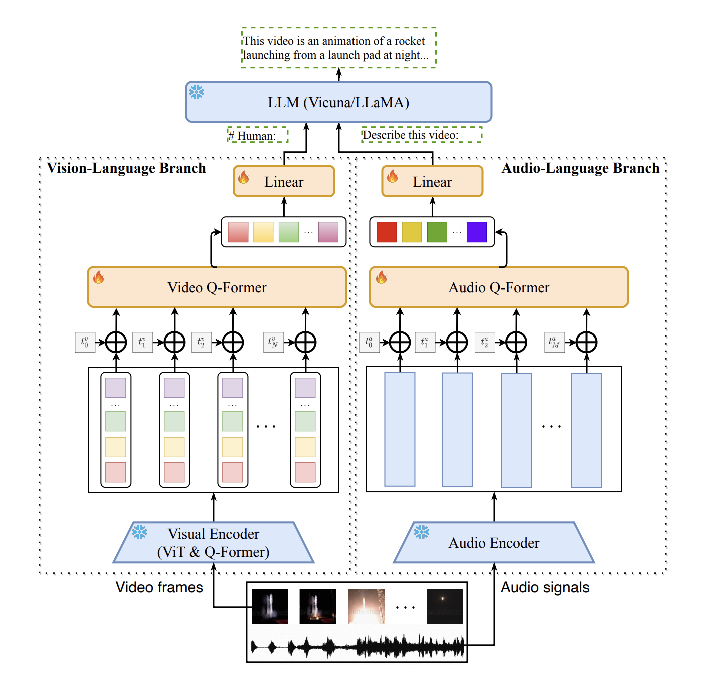

# video-SALMONN: Speech-Enhanced Audio-Visual Large Language Models

[https://arxiv.org/pdf/2406.15704](https://arxiv.org/pdf/2406.15704)

Коллеги из ByteDance и Tsinghua University, написавшие статью про [SALMONN](../ASR%208e24b5a9530f46cdb4b0c075ab393a43/SALMONN%20TOWARDS%20GENERIC%20HEARING%20ABILITIES%20FOR%20LARG%2072537a04a3574bc1bbb9aa97311cc536.md), предлагают интересный способ добавления видео-модальности в их модель.

На выходе получают первую и пока единственную видео-аудио-LLM, которая умеет не только в sound-фичи/speech-фичи, а сразу в их комбинацию. Также, в отличии от имеющихся моделей, архитектура **video-SALMONN** подразумевает тесные interactions между векторами аудио и видео-модальностей в рамках одного временного промежутка.

## Архитектура

Сначала можем взглянуть на архитектуры **Video-LLaMA**, **X-LLM** и **Macaw-LLM:**

- **Video-LLaMA**
    
    В этой модели используются Q-Former-ы для извлечения фичей из аудио и видео-энкодеров. В качестве аудио-энкодера исползьуется [ImageBind](https://imagebind.metademolab.com/) - модель от Meta, которая умеет эмбеддить разные модальности в одно векторное пространство. 
    
    Обучают в 3 стадии:
    
    - Сначала предобучают отдельно Vision-Language Branch
    - Затем отдельно Audio-Language Branch
    - Затем совметсно
    
    Из интересного - авторы говорят что у них было мало audio-text данных, поэтому для обучения Audio-Language Branch они использовали vision-text данные (могут так делать т.к. ImageBind также умеет эмбеддить картинки, причем в то же векторное пространство, что и аудио).
    
    
    
    На какие проблемы Video-LLaMA указывают авторы статьи video-SALMONN:
    
    - Нет speech-энкодера (ImageBind - про звуки, не про речь)
    - Нет явного временного алайнмента между аудио и видео, т.е. модель не понимает что “в этот таймстемп была вот такая картинка с вот таким звуком, полезная информация обо всем этом объединилась и лежит в одном векторе”
- **X-LLM**
    
    Здесь также можем видеть Q-Former-ы, но вместо sound-энкодера здесь используется Speech-Encoder. После него вместо Q-former-а используется C-Former: CIF-module + 12 слоев трансформера. Не шарю, что значит CIF-module, но он сжимает временную размерность инпута до длины временной размерности аутпута (транскрипции).
    
    Для обучения выделяют три стадии:
    
    1. **Converting Multimodal Information**
        - Для Image-интерфейса берут веса Q-Former-а из BLIP2. Отмечают, что хоть в BLIP2 q-former и обучали на английских img-text парах, веса все равно подходят для использвания в китайской LM-ке
        - Для Speech-модуля обучают CIF-based ASR-модель и используют ее для speech encoder-а и CIF-части C-former-а
    2.  **Aligning X2L Representations with the LLM**
        
        Во второй стадии с помощью X-to-Text  задач доучивают modality-specific модули
        
        - Инициализируют Q-former весами из BLIP2 и доучивают на img-text парах на китайском языке
        - Полученные веса используют для инициализации video-интерфейса, потом его доучивают на video-text данных
        - Speech-часть доучивают на ASR
    3.  **Third Training stage: Integrating Multiple Modalities**
        
        Здесь в задачах обучения уже используют мультимодальность, например - аудио-вопрос про картинку
        
    
    
    
    На какие проблемы X-LLM указывают авторы статьи video-SALMONN:
    
    - Нет аудио-энкодера, только speech-энкодер, к тому же явно погруженный в текстовое пространство за счет CIF-модуля
    - Нет явного временного алайнмента между аудио и видео, т.е. модель не понимает что “в этот таймстемп была вот такая картинка с вот таким звуком, полезная информация обо всем этом объединилась и лежит в одном векторе”
- **Macaw-LLM**
    
    
    
    Ничего интересного
    

Теперь к архитектуре video-SALMONN:

В архитектуре можем выделить 4 главных модуля:

- **Modality-Specific Encoders**
    - Speech Encoder == Whisper Large - энкодит спич с частотой 50Гц
    - Audio Encoder == BEATs - энкодит аудио с частотой 50Гц
    - Visual Encoder == InstructBLIP image энкодер - энкодит видео c частотой 2 кадра в секунду, на каждый кадр выдает 32 эмбеддинга
        
        
        
    
    Представляет из себя CLIP-ViT + Q-Former, доученный на image captioning.
    
- **Temporal Fine-grained Synchronisation**
    
    Модуль, в котором происходит временная синхронизация аудио и визуальных фичей.
    
    Синхронизация происходит каждые 0.5 секунд (т.к. это минимальный фреймрейт среди энкодеров). Для каждого 0.5-секундного чанка мы имеем 25 векторов аудио-эмбеддингов (конкатенированных векторов из speech + audio encoder-ов) и 32 вектора визульаных эмбеддингов. Мы паддим аудио-фичи до длины 32 и конкатим по размерности фичей (еще в каком-то месте происходит линейная проекция). Получаем для каждого 0.5-секундного чанка набор из 32 векторов с аудио+визуальной информацией.
    
    В случаях, когда аудио-фичи недоступны, их замеяем нулевым паддингом.
    
    В случаях, когда на вход вместо видео подают картинку + аудио, мы повторяем ее эмбеддинги столько раз, сколько требуется для энкодинга всего аудио.
    
- **MRC Q-Former**
    
    Когда мы получили эмбеддинги с предыдущего модуля, хочется сжать эту последовательность (64 эмбеддинга в секунду - много) + как-то перемешать между собой аудио + видео фичи.
    
    При этом хочется сохранить информацию разного временного разрешения. Авторы предлагают делать это с помощью Multiresolution Causal Q-former.
    
    
    

Как оно работает:

- Определяемся, сколько разных разрешений мы хотим иметь (в случае на картинке - 2)
- Для каждого разрешения надо определить временное разрешение окна $W(r)$ , на котором применяется Q-former + число обучаемых queries $N(r)$ в Q-former-е
- Чтобы Q-former из каждого разрешения выдавал одно и то же число эмбеддингов для инпута, надо чтобы $W(r) * N(r) = const$.
    
    Логика такая - если мы считаем эмбеддинги для большого количества маленьких окон, то для каждого окна эмбеддингов должно быть небольшое количество (в маленьком окне - мало данных). Если окна большие - эмбеддингов для каждого окна надо побольше. Но за счет того, что окон будет меньше, получим то же самое число эмбеддингов на выходе.
    
- Когда получаем выходы с Q-former-ов разных разрешений, прогоняем каждый из выходов через свой слой проекции и складываем.

Еще не было объяснений, почему в названии модуля присутсвтует слово Causal.

Объяснение простое - в Cross-Attention—модулях Q-former-а используется пофреймовая causal маска для улавливания временной зависимости между фреймами (т.к. в картиночных эмбеддингах не заложена никакая временная зависимость).

Говорят что это поможет отвечать на causal-вопросы по типу “Что было дальше?” и что простое добавление позиционных эмбеддингов может не справиться с этим.

## Задача обучения

Сама задача обучения в целом классическая - суем инструкции/данные из разных модальностей и учим на кросс-энтропию. 

Небольшая модификация задачи обучения - diversity loss на представления, которые выдает Q-former. Логика следующая: на задачах вроде Video QA обычно достаточно пары ключевых фреймов, чтобы ответить на поставленный вопрос. Это может побудить модель дублировать кажущиеся ей полезными эмбеддинги, вместо сбора всей информации (пусть и не нужной для ответа на конкретный вопрос из датасета).

Предлагают бороться с этой проблемой, используя следующий лосс:

## Experimental Setup

### **Speech-Audio-Visual Evaluation Benchmark**

Авторы сделали свой бенчмарк SAVE для оценки модели, который содержит “representative tasks for both single and multi-modal tasks”.

**Single-modal tasks:**

1. ASR
2. Automatic Audio Captioning (AAC)
3. Image Captioning (IC)
4. Optical Character Recognition (OCR)
5. Visual Question Answer (VQA)
6. Video Question Answer (Video QA)

**Multi-modal tasks:**

1. Audio-Visual Speech Recognition (AVSR)
2. Audio-Visual QA (AVQA)
3. Audio-Visual Matching (AVM)
4. Audio-Visual Sound Source Detection (AVSSD)

### Model Configurations

В качестве **LLM** берут **Vicuna-v1.5** 13B ****и ****7B. ****Дообучают ее с помощью **LoRA** с rank=32 на QKV в attention и на весах FFN.

**Speech Encoder** == Whisper-large v2 - 50 фичей в секунду

**Audio Encoder** == BEATs - 50 фичей в секунду

**VIsualEncoder** == CLIP ViT + Q-former из InstructBLIP - 32 фичи на картинку = 64 фичи в секунду

**MRC Q-former** состоит из 2 трансформерных блоков и имеет размерность 768. Используют 2 разрешения:

1. Размер окна = 0.5 секунд, число query-векторов — 3
2. Размер окна = 5 секунд, число query-векторов — 30

### **Training Data and Specifications**

Обучают сразу в Multi-task instruction режиме, причем как на single-modal данных, так и на audio-visual данных.

Данные для **Audio-only tasks:**

- ASR on LibriSpeech train-clean 100 & train-clean 360
- AAC on AudioCaps

Данные для **Visual-only tasks:**

- Image QA on LLAVA-150
- OCR on OCRVQA
- Image Caption Data on TextCaps
- Video QA on NExT-QA
- Какая-то таска on 5000 сэмплов из COCO train2014 с spoken captions + 11000 сэмплов из VideoChat

Данные для **Audio-Visual tasks:**

- Video Captioning on Случайно выбранные 600 часов из Ego4D
- AVSR on 300h-train set How2
- AVSD (Audio-Visual Scene-Aware dialogue) on 300h-train set How2

Всего в обучающих данных было примерно 1M сэмплов, из которых меньше 300К видео. Все данные открытые.

Про все сеты можно глянуть в аппендиксе статьи.

## Results

Результаты для multi-modal и single-modal задачек в табличках ниже.

**Single-modal результаты**: 

Прикольно, побили Whisper на ASR (на LibriSpeech-е, правда). 

Также сильно напихали Video-LLaMA по всем пунктам, а InstructBLIP-у немного уступили только на VQA.

Также интересно, что добавление Audio-модальности бустит OCR и IC-способности модели (сравниваем последнюю и вторую с конца строчки таблицы 1)

На мультимодальных сетах значимо пихают всем унимодальным моделям. Также виден большой буст от использования аудио-фичей на AVQA и AVSSD.

Распознают речь в режиме AVSR лучше Whisper-а.

Полезная табличка с Ablations:

Также авторы решили дополнительно показать, что для разных задач полезны разные временные разрешения. 

Для этого берут Q-former только с одним временным разрешением, меняют размер окна, обучают и замеряют качество Video QA и AVSR.

Логично, что VideoQA будет лучше работать с большим размером окна, а AVSR - с маленьким. По графикам именно это и получаем.

Похожую логику авторы показывают еще и следующим способом: зануляют выходы из Q-formerа определенного разрешения у обученной модели и замеряют качество на задачах ASR, IC и Video QA в таком сетапе. 

Получают логичную табличку:

Пара табличек из аппендикса с метриками ASR на аудио + губах и с метриками MUSIC-AVQA (обучения на MUSIC-AVQA не было):

