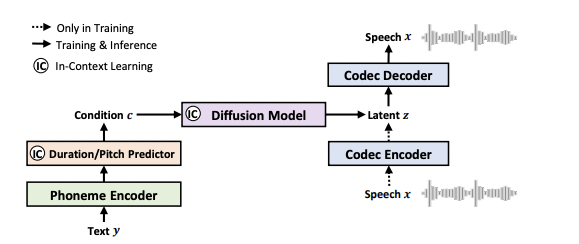
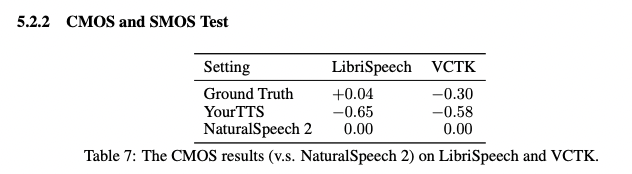
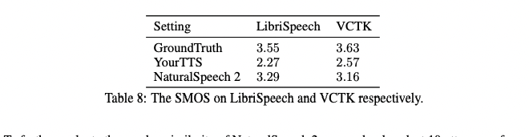
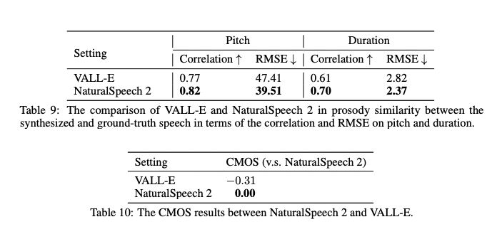

# NaturalSpeech 2: Latent Diffusion Models are Natural and Zero-Shot Speech and Singing Synthesizers

Исследователи из Microsoft предложили объединить все самое хайповое на текущий день в одну модельку для клонирования голоса (+ пишут и показывают на сайте с примерами что моделька даже может петь, если добавить ей в трейн соответствующие данные).

Ссылка: [https://arxiv.org/pdf/2304.09116.pdf](https://arxiv.org/pdf/2304.09116.pdf)

# Архитектура модели

Из чего состоит модель:
i) Нейронный кодек - состоит из светрочного энкодера, модуля residual-квантизации, декодера. Работает следующим образом:

i) На вход поступает звуковой сигнал, который подается на сверточный энкодер.
ii) Энкодер преобразует сигнал в латентное пространство, где каждый вектор представляет собой скрытое представление исходного сигнала.
iii) Затем, этот латентный

Модель состоит из следующих частей:

1) **Нейронный кодек**. Он, в свою очередь состоит из сверточного энкодера, модуля residual-квантизации и сверточного декодера. Взят из статьи [SoundStream](https://arxiv.org/pdf/2107.03312.pdf). Как он работает:

i) Берет входное аудио $x$ 
ii) Применяет к нему сверточный энкодер: $h = f_{enc}(x)$

iii) Применяет модуль residual-квантизации: 

$$
\{e_j^i\}_{j=1}^R = f_{rvq}(h^i), \space z^i = \sum_{j=1}^{R}e_j^i, z=\{z^i\}_{i=1}^{n}
$$

iv) Применяет к полученным состояниям сверточный декодер: $x = f_{dec}(z)$

Здесь $R$ - количество residual-модулей в квантизации, $n$ - количество фреймов на выходе энкодера. Обучается эта штука отдельно, лоссы (да и в целом все, касающееся нейронного кодека) взяты как в статье [SoundStream](https://arxiv.org/pdf/2107.03312.pdf).

Снизу картиночка из статьи.

2) **Диффузионная модель** (латентная).

При желании можно почитать дефолтную формулировку задачи для диффузионной модели в виде стохастического уравнения, мы же обратим внимание только на “новый” кусок лосса.

Нас здесь будет интересовать последний член лосса, который есть кросс-энтропия над квантизатором. Для каждого из residual-квантизаторов (как помним, их у нас $R$ последовательных штук) мы будем предсказывать распределение над кодбуками и затем брать кросс-энтропийный лосс с ground-truth распределением. Все, в остальном - дефолтная задача диффузии. В качестве модели используют WaveNet.

3) **Prior Model: Phoneme Encoder и Duration/Picth Predictor**

Для извлечения фичей из фонем используют слои трансформера, в котором заменяют feed-forward на свертку с ядром 9 (expansion по каналам так же остается равным 4). Duration и Pitch предикторы представляют из себя одинаковые сверточные сетки, которые учатся на ground-truth duration и pitch. Как используется duration: они расширяют фичи из phoneme encoder-а. Как используется питч: его фичи добавляются к фичам из phoneme encoder-а.

**Speech Prompting for In-Context Learning**

В этой части разберем предложенную авторами идею по затаскиванию информации о спикере в модель. Они предложили во время трейна брать выходы из нейронного энкодера аудио (заранее обученного) и вырезать из него какой-то связный кусок:

Было $z^{1..n}, \space вырезали \space z^{u..v}$, взяли этот кусок в качетсве *speech prompt,* а оставшиеся хвосты сконкатили и теперь на это будем обучать нашу модель. 

Как используется вырезанный кусок:
Он идет в качестве *{key,value}* в Duration и Pitch энкодеры, в которые добавляются слои Attention. В диффузионную модель тоже хочется добавить эту информацию. Авторы пишут, что они решили не подавать этот кусок аналогично предыдущему способу в дффузию т.к. это слишком сильная подсказка для нашей модели и может попортить инференс. Они решили усложнить задачу. Сначала они передают этот кусок как *{key, value}* в Attention, где в качетсве *query* используются случайные вектора. Дальше результат этого аттеншна идет в качестве *{key, value}* уже в Attention-блок в диффузионной модели, но выход этого блока используется по-хитрому через FiLM-слой. Подробнее на картинке.

FiLM-слой представляет собой обусловленное афинное преобразование. Обуславливается оно, соответственно, на выход аттеншна.

По словам авторов, описанный в этом блоке подход делает модель zero-shot робастной. 

Обучается все это дело на лосс диффузии + Pitch/Duration предикторы обучаются на ground-truth pitch и duration трейновых записей (pitch они извлекают с помощью библиотеки PyWorld, duration для каждой фонемы получают с помощью каких-то своих внутренних инструментов).

# **Обучение и результаты**

Обучались на английском сабсете Multilingual LibriSpeech, там было 44К часов аудио с сэмпл рэйтом 16кГц. Валидировались на VCTK и LibriSpeech test-clean (все спикеры на валидации unseen, соответсвтенно результаты будут показывать zero-shot робастность).

Информацию о конфигурации модели можно посмотреть в статье (часть вставил картинкой ниже), суммарно в ней получилось 400М параметров.

Сравнивали они свою модель с YourTTS. Вставлю несколько табличек, но суть на всех одинакова - NaturalSpeech2 везде значимо лучше и почти так же хорош, как и ground-truth (в сравнениях с “человеческими” метриками CMOS и SMOS).

